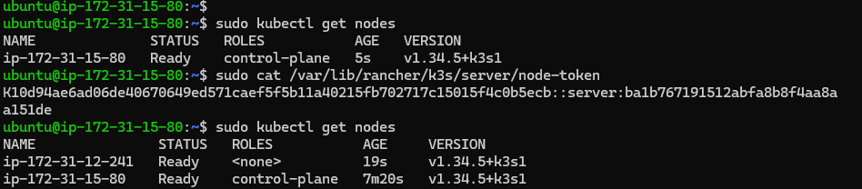
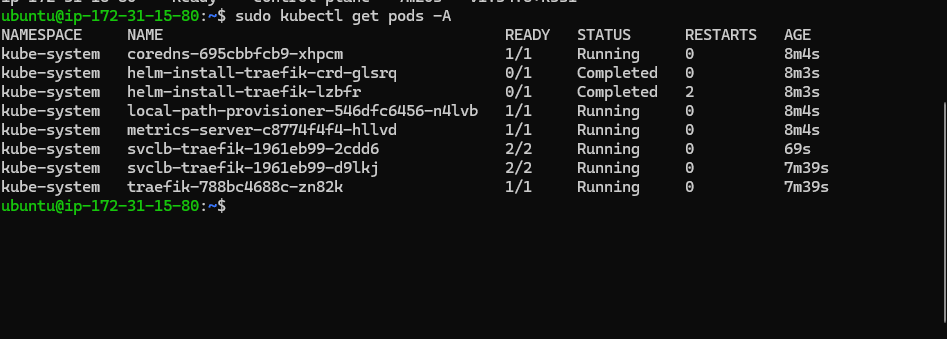

# Assignment 1: K3s Deployment on AWS
**Name:** Mpho Quinton Swele  
**Student Number:** [Your Student Number]  
**Course:** Advanced Diploma in IT (Communication Networks)

---

## 🏗 Architecture Explanation
### What is K3s?
K3s is a highly available, certified Kubernetes distribution designed for low-resource environments such as Edge, IoT, and 5G infrastructures. It is packaged as a single binary (<100MB) by removing legacy, alpha, and non-default features found in standard upstream Kubernetes.

### Key Components
* **Control Plane:** The brain of the cluster, containing the API Server (entry point), Scheduler (assigns pods), and Controller Manager (maintains desired state).
* **Agents (Worker Nodes):** The hosts where the actual containerized workloads run.
* **Container Runtime:** Uses **containerd** as a lightweight, industry-standard runtime.
* **CNI (Flannel):** Manages the L3 networking fabric for Pod-to-Pod communication.
* **Kine:** A shim that allows K3s to use **SQLite** (embedded) instead of the resource-heavy etcd, perfect for edge deployments.
* **ServiceLB & Traefik:** Built-in Load Balancer and Ingress controller for exposing services.

---

## 🖥 System Requirements
The following AWS EC2 specifications were used to ensure a stable hybrid environment:

| Requirement | Control Plane (Server) | Agent (Worker) |
| :--- | :--- | :--- |
| **Instance Type** | t3.medium | t3.small |
| **vCPU** | 2 | 1 |
| **RAM** | 4 GB | 2 GB |
| **Storage** | 20 GB gp3 SSD | 20 GB gp3 SSD |
| **OS** | Ubuntu 22.04 LTS | Ubuntu 22.04 LTS |

---

## 🛠 Installation Steps & Commands

### 1. Provisioning & Security
Configured an AWS VPC with a Security Group allowing:
* 6443/tcp: Kubernetes API Server
* 8472/udp: Flannel VXLAN
* 10250/tcp: Kubelet metrics

### 2. K3s Server Setup (Control Plane)
Run the following on the Server instance:
```bash
curl -sfL [https://get.k3s.io](https://get.k3s.io) | sh -
# Verify installation
sudo k3s kubectl get nodes
# Extract the node token for agent registration
sudo cat /var/lib/rancher/k3s/server/node-token


## Deployment Evidence

### Multi-Node Cluster Status


### System Pods Status


